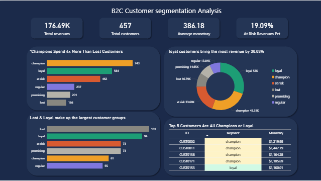

# Part 2: Customer Segmentation Analysis
> *This project is Part 2 of a two-part portfolio. [Part 1 — Sales Performance & Loss Analysis](https://github.com/abdelrhman-mahmoud-DA/sales-performance-analysis) identified a 16.2% loss order rate and surfaced three root causes. This project answers the follow-up question: who are the customers behind that revenue, and how do we retain the most valuable ones?*
 
---
 
## Project Overview
 
This project applies **RFM (Recency, Frequency, Monetary) analysis** to segment 457 customers into six behavioral groups, identify at-risk revenue, and provide actionable retention recommendations. The analysis was built end-to-end using **MySQL** for data cleaning and RFM scoring, and **Power BI** for dashboard visualization.
 
**Business Question:** Who are our most valuable customers, and which ones are we about to lose?
 
---
 
## Dataset
 
Two synthetic tables simulating a B2C retail environment:
 
| Table | Rows | Description |
|---|---|---|
| `customers` | 500 | Customer demographics: city, country, age group, gender |
| `transactions` | ~3,155 | Order-level data: product, quantity, price, discount, revenue, profit |
 
**Date range:** January 2022 – December 2024  
**Products:** 15 consumer electronics and accessories  
**Regions:** Egypt, UAE, Saudi Arabia, Jordan, Lebanon, Kuwait
 
---
 
## Tools Used
 
| Tool | Purpose |
|---|---|
| MySQL | Data cleaning, RFM scoring, segmentation, KPI queries |
| Power BI | Dashboard design and visualization |
| GitHub | Project documentation and version control |
 
---
 
## Data Cleaning Pipeline
 
Raw data contained four intentional quality issues, cleaned across a three-stage pipeline:
 
### Issues Found
 
| Issue | Detail | Fix |
|---|---|---|
| Empty strings | ~3% of emails, ~2% of cities stored as `''` not `NULL` | `UPDATE ... SET column = NULL WHERE column = ''` |
| Duplicate transactions | ~2% of orders appeared twice (69 duplicates) | `ROW_NUMBER()` partitioned by customer, product, quantity, revenue, date |
| Price anomalies | ~4% of rows had unit prices 70–90% below normal | Filtered rows where `unit_price < AVG(unit_price) * 0.5` per product |
| Non-completed orders | Returned and Cancelled orders included | `WHERE order_status = 'Completed'` |
 
### Tables Created
 
```
transactions          →   transactions_cleaned   →   transactions_rfm
(3,155 raw rows)          (duplicates removed)       (1,802 clean rows)
```
 
---
 
## RFM Scoring Logic
 
RFM was calculated on `transactions_rfm` (1,802 completed, clean orders across 457 customers).
 
| Metric | Definition | Formula |
|---|---|---|
| Recency | Days since last purchase | `DATEDIFF('2024-12-30', MAX(transaction_date))` |
| Frequency | Number of distinct purchase dates | `COUNT(DISTINCT transaction_date)` |
| Monetary | Total revenue generated | `ROUND(SUM(revenue), 2)` |
 
Each metric was scored 1–4 using `NTILE(4)`. Recency was ordered descending (lower days = higher score). Segments were assigned using R and F scores:
 
| Condition | Segment |
|---|---|
| R=4 AND F=4 | Champion |
| R≥3 AND F≥3 | Loyal |
| R≥3 AND F≤2 | Promising |
| R≤2 AND F≥3 | At Risk |
| R=1 AND F≤2 | Lost |
| Everything else | Regular |
 
---
 
## Key Findings
 
### Segment Distribution
 
| Segment | Customers | Avg Recency (days) | Avg Frequency | Avg Monetary |
|---|---|---|---|---|
| Champion | 61 | 18 | 7.7 | $743 |
| Loyal | 94 | 112 | 5.8 | $564 |
| At Risk | 73 | 565 | 4.7 | $462 |
| Regular | 55 | 486 | 2.5 | $237 |
| Promising | 73 | 78 | 1.8 | $201 |
| Lost | 101 | 883 | 1.7 | $166 |
 
### Revenue Contribution
 
| Segment | Revenue % |
|---|---|
| Loyal | 30.03% |
| Champion | 25.67% |
| At Risk | 19.09% |
| Lost | 9.51% |
| Promising | 8.30% |
| Regular | 7.39% |
 
**Critical insight:** At Risk customers represent 19% of total revenue from customers who have not purchased in an average of 565 days. This is the highest-priority retention opportunity.
 
---
 
## Business Recommendations
 
**1. Protect Champions (61 customers, 25.7% of revenue)**
Champions buy recently and frequently. Offer loyalty rewards and early access to new products to prevent churn.
 
**2. Re-engage At Risk customers (73 customers, 19% of revenue)**
These customers were once active but have gone quiet for an average of 565 days. A targeted win-back campaign with personalized discounts could recover a significant portion of this revenue before they become Lost.
 
**3. Develop Promising customers (73 customers)**
Recent buyers with low frequency — they just haven't committed yet. Nurture with follow-up emails, product recommendations, and introductory offers to increase purchase frequency.
 
**4. Deprioritize Lost customers (101 customers, 9.5% of revenue)**
With an average recency of 883 days and only 1–2 lifetime purchases, the cost of re-engagement likely outweighs the return. Focus budget elsewhere.
 
---
 
## Dashboard



Built in Power BI with a navy dark theme consistent with the Part 1 dashboard.
 
**Visuals:**
- 4 KPI cards: Total Revenue, Total Customers, Avg Spend per Customer, At Risk Revenue %
- Horizontal bar chart: Average monetary per segment
- Donut chart: Revenue contribution % per segment
- Horizontal bar chart: Customer count per segment
- Table: Top 5 customers by revenue
---
 
## Project Structure
 
```
├── data/
│   ├── customers.csv
│   └── transactions.csv
├── sql/
│   ├── 01_data_cleaning.sql
│   ├── 02_rfm_scoring.sql
│   └── 03_kpi_queries.sql
├── powerbi/
│   └── customer_segmentation.pbix
└── README.md
```
 
---
 
## Connection to Part 1
 
Part 1 diagnosed *what* was broken in sales performance — loss orders, margin-negative products, and rep-level discounting issues. This project identifies *who* to focus on to address those findings:
 
- Champions and Loyal customers should be protected from discount abuse identified in Part 1
- At Risk customers represent recoverable revenue that loss orders may have eroded
- The combined analysis provides both a diagnostic (Part 1) and a strategic customer lens (Part 2)
---
 
*Analysis by Abdelrhman Mahmoud | [Part 1: Sales Performance Analysis](https://github.com/abdelrhman-mahmoud-DA/sales-performance-analysis)*
